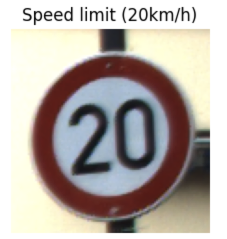

## Overview
This repository contains the `Adversarial Attack.ipynb` notebook, which explores the vulnerability of deep learning image classification models to adversarial attacks. The project specifically targets a model trained on the **German Traffic Sign Recognition Benchmark (GTSRB)**, demonstrating how subtle, imperceptible perturbations added to traffic sign images can successfully deceive a computer vision system.

## Model Used
Resnet 18

## Adversarial Method Used
PGD Attacks

## Attack Results

**Before** 

  
** Accuracy: 80 %** * (Correctly classified) *
