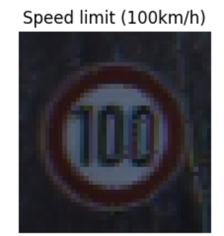

## Overview
This repository contains the `Adversarial Attack.ipynb` notebook, which explores the vulnerability of deep learning image classification models to adversarial attacks. The project specifically targets a model trained on the **German Traffic Sign Recognition Benchmark (GTSRB)**, demonstrating how subtle, imperceptible perturbations added to traffic sign images can successfully deceive a computer vision system.

## Model Used
Resnet 18

## Adversarial Method Used
PGD Attacks

##  Attack Results

### 🟢 Before
  
 
<b>Accuracy: 71%</b>   <i>(Correctly classified)</i>

 
 

### 🔴 After
 &nbsp;&nbsp; ➡️ &nbsp;&nbsp; 
 
<b>Predicted as 100 km/h Speed Limit 99% of the time</b>   <i>(Actually a 20 km/h sign)</i>

